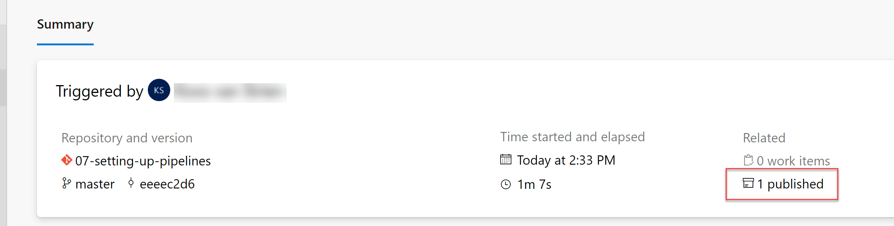
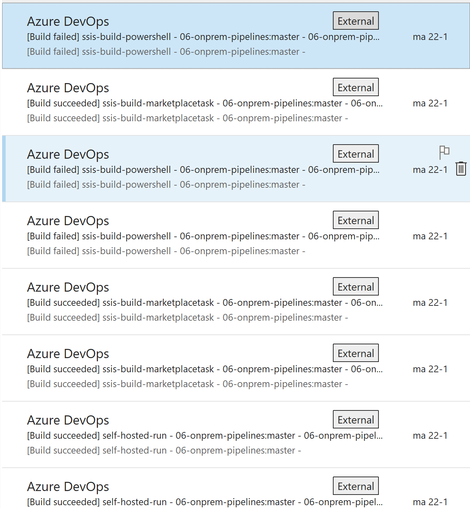
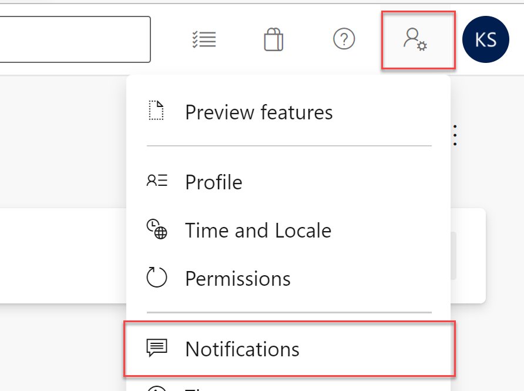

# Build pipelines

## Introduction

In the Azure Repos Lab, we briefly looked at an Azure Build Pipeline. In this module, we will delve deeper into using the following aspects of the Azure Build Pipeline:

* Analyzing build results
* Manually triggering builds
* Customizing notifications

## Analyzing Build Results

In the Azure Repos Lab, we have already looked at the build results. Here, we will explore them in more detail.

1. Open the build results of the most recent successful build from the "build-pipeline" pipeline.
2. Examine the information displayed in the "summary":
   * Which commit was used as the basis for this build?
   * What is the outcome (artifact)?
   * Which "jobs" were executed?

### Output of the build steps

To see the results and logging, let's dig a little deeper. We will examine the *Job* that actually performed the build.

3. Click on the *Job* at the bottom of the *Summary* screen.
4. Review the output of the "Initialize job" step:
   * What happens in this step?
   * If something goes wrong, could you address it yourself?
5. Examine the output of the "Checkout" step:
   * Where does this output come from?
6. Review the output of the "Build Data Warehouse" step:
   * Where does this output come from?
7. Review the output of the "Copy Files to: (...)" step.
8. Review the output of the "PublishPipelineArtifact" step:
   * What happens in this step?
   * What would happen if we remove this step? Would the build still be executed?
9. Review the output of the "post-job: checkout" and "Finalize Job" steps:
   * This is more of the build agent's "housekeeping," which you have little control over or cannot change.

### Displaying Artifacts

Now, go back to the summary screen. As you saw above, an "Artifact" has been published. We can also inspect it:

10. Click on the text "**1 published**" in the middle of the screen.
    * 
    * Here, you can see all the _artifacts_ produced in the current build. Currently, there is only one, but there could potentially be more.
10. Click on the `SQLDW` artifact.
11. Navigate through the folder structure and examine the artifact.

If you have never examined a DACPAC before, here's a fun little extra assignment:

13. Download the file `AdventureWorksDW.dacpac` from the Artifacts Explorer.
13. Rename the file to `AdventureWorksDW.dacpac.zip`.
13. Unzip the ZIP file into a new folder and examine its contents.
13. Open the `model.xml` file with software such as Notepad++ or Visual Studio Code. Do you recognize the structure?

## Manually Triggering a Build

So far, all builds have been executed automatically. However, in cases such as a failure in the _build agent_, you may need to manually start a build. It may also be the case that Continuous Integration is disabled for your pipeline, requiring you to manually trigger all builds.

17. Open the "build-pipeline" build pipeline.
17. Click the blue "Run new" button in the top right corner.
    * Although a new window will open, allowing you to specify settings for a specific commit, branch, or tag, simply clicking "Run" here is sufficient to execute a build for the most recent commit.

## Customizing Notifications

By default, you receive an email for every build that occurs. While there may be situations where this is desirable, often it is not. Therefore, let's customize this now. *Customizing notifications extends beyond build pipelines alone!*

> If you're working on the Wortell Smart Learning organization within Azure DevOps (with a "student" user), you won't receive any notification because there is no email box behind these users. However, as soon as you [set up an organization for yourself](https://devopsdeployment.westeurope.cloudapp.azure.com), you will receive (a lot) of emails with notifications about builds, PRs, etc. In this section you'll learn how to customize these notifications.
>
> 

19. Click on the "User settings" icon in the top right corner of the screen (the icon depicting a person and a gear).
19. Select "Notifications."
    
19. Review the various notification settings.
19. Disable the "Build completes" notification.
19. Manually trigger a new build to verify that you no longer receive an email notification.