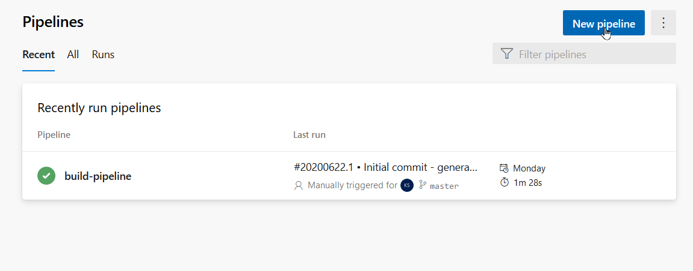
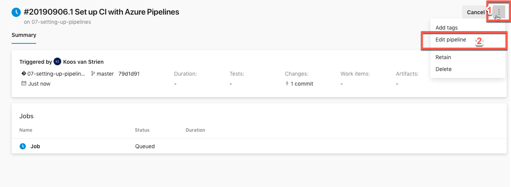

# Setting up a basic build pipeline

## Introduction

We will create a small build pipeline that executes SQL Server builds. We will explore how to set it up neatly using variables and how to use pipeline version control to view older versions of a pipeline. In a later module, we will look into builds for other project types like SSIS and SSAS.

## Setting up a basic build pipeline

In your new Azure DevOps project, there is one build pipeline present. However, we will leave it aside for now and create a new one. Setting up a random build pipeline is straightforward, but Azure DevOps has traditionally focused more on application development than data solutions. Therefore, we will need to perform a few additional manual steps.

1. Open Pipelines -> Pipelines.
   * 
1. In this project, there is one existing pipeline (`build-pipeline`). Now, create a new pipeline:
   * Click **New Pipeline**.
   * Get the code from Azure Repos Git.
   * There should be only one repository, which you created in the previous module.
   * Choose "No template" and start with a **starter pipeline**.
1. Click on the name (`azure-pipelines.yml`) and rename the pipeline to **Build database**.
1. Click **Save and Run** and provide a meaningful commit message.
   * You may notice that your commit is blocked, and you are not allowed to commit directly to the main branch. Use your knowledge of pull requests and feature branching to address this (seek support if you are unable to resolve it!).

We have now created a dummy pipeline with only a "Hello, world!" script. You have also indicated the name of the YAML file (`Build database.yml`). Unfortunately, Azure DevOps Pipelines does not automatically adopt this name for the pipeline registration itself. By inspecting it, see if you can also modify it.

This is not very useful, so let's make some changes:

## My First YAML pipeline

Click on the ellipsis (...) in the top right corner of the screen and select **Edit pipeline**.



You will now see a YAML pipeline. YAML (YAML Ain't Markup Language) is a language commonly used for configuration files and infrastructure-as-code.

Here is a basic YAML pipeline structure:

```yaml
# Build Pipeline for SQL Database

# The *trigger* specifies what triggers this pipeline to run automatically. In this case: a *commit* against *main*
trigger:
- main

# The *pool* specifies which VM image to use for executing this pipeline.
pool:
  name: Azure Pipelines
  vmImage: windows-latest

# Here come the actual "build steps". In this case, we have a "simple" build pipeline - we will explore pipelines with multiple "stages" later.
steps:
```

**The above structure is not complete** - and that is intentional :-). We will use this structure to build a "working" build pipeline.

5. Edit the YAML pipeline you just created by clicking on the ellipsis (`...`) to the right of your pipeline.
5. Copy the above pipeline and **replace** the entire YAML code in the existing pipeline with the above code.
5. Search for a **Visual Studio Build** task in the tasks and click on it.
5. Configure it as follows:
   * Solution: `src/AdventureWorksDW/AdventureWorksDW.sqlproj`
   * Configuration: `Release`
   * Click **Add** to add it to your YAML script.
5. Save this pipeline and run it.

Check the results for this job.

> We now have a small working build pipeline. Some details (such as the use of

 wildcards `**` and `*`) will be further explained in the [next exercise](./03-build-pipeline-advanced.md). For now, we want to quickly work towards a functional pipeline.
>
> Although the job should run correctly, you will not yet see an Artifact. Therefore, there is no output to be passed on to the Release. It's time to address that!

## Pipeline Artifacts

We will add two steps to collect artifacts in the newly created build pipeline:

> Make sure your cursor is at the end of the YAML file - the *task* will be inserted where the cursor is.

10. Collecting objects into the build artifact by copying them to a single folder
    * Use a *copy files* task for this.
    * Source folder: `$(Build.SourcesDirectory)`
    * Contents: `**/bin/Release/**/*.dacpac`
    * Target Folder: `$(Build.ArtifactStagingDirectory)`
    * Also, expand the *Advanced* section and click on *Flatten Folders*.
10. Publishing the artifact
    * Use a *Publish Pipeline Artifact* task for this.
    * File or directory path: `$(Build.ArtifactStagingDirectory)`
    * Artifact name: SQLDW
    * Artifact publish location: Azure Pipelines
10. Save the pipeline and run it.

The pipeline will now look something like this:

```yaml
# Build Pipeline for SQL Database

# The *trigger* specifies what triggers this pipeline to run automatically. In this case: a *commit* against *main*
trigger:
- main

# The *pool* specifies which VM image to use for executing this pipeline.
pool:
  name: Azure Pipelines
  vmImage: windows-latest

# Here come the actual "build steps". In this case, we have a "simple" build pipeline - we will explore pipelines with multiple "stages" later.
steps:
### You do not need to remember the configuration of a "task": Azure DevOps Pipelines has built-in visual tools for adding tasks and configuring their settings.
- task: VSBuild@1
  displayName: 'Build Data Warehouse'
  inputs:
    solution: 'src/AdventureWorksDW/AdventureWorksDW.sqlproj'
    configuration: 'Release'

- task: CopyFiles@2
  displayName: 'Copy Files to: $(Build.ArtifactStagingDirectory)'
  inputs:
    SourceFolder: '$(Build.SourcesDirectory)'
    Contents: '**/bin/Release/**/*.dacpac'
    TargetFolder: '$(Build.ArtifactStagingDirectory)'

# The Artifact is the result of this pipeline. By publishing it, a deployment pipeline can pick it up for deployment to other environments.
- task: PublishPipelineArtifact@1
  inputs:
    targetPath: '$(Build.ArtifactStagingDirectory)'
    artifact: 'SQLDW'
    publishLocation: 'pipeline'
```

Now we have a small working build pipeline. Before implementing the final improvement, it's useful to know about *Variables*.

> After saving a pipeline, you can click **Run** directly. However, this is not necessary. The pipeline already has a *trigger* that is activated by every *commit* you make to `main`. Simply saving the pipeline will execute it.

## Variables

Above, you used system variables. These variables are set by Azure DevOps for an agent and can be used to dynamically populate values. In our case above, we had two variables:

* `$(Build.SourcesDirectory)`
* `$(Build.ArtifactStagingDirectory)`

On the Microsoft documentation page [Predefined Variables](https://docs.microsoft.com/en-us/azure/devops/pipelines/build/variables?view=azure-devops), you can find a list of predefined variables. Explore them and look up the meaning of the above variables.

In addition to *pre-defined variables*, you can also [work with variables](https://docs.microsoft.com/en-us/azure/devops/pipelines/process/variables?view=azure-devops&tabs=yaml) on your own. In this, you can:

* Securely store usernames and passwords.
* Enable or disable debug parameters for an entire pipeline.
* Centrally store build settings for the entire pipeline.

## Icing on the cake

To finish the pipeline neatly, create a variable for the *Build Configuration*:

* Variable name: `BuildConfiguration`
* Value: `Release`

The exact location and code are described in the [Build Pipelines Advanced](03-build-pipeline-advanced.md) section. You are free to use it, or you can try to add the variable yourself in the right place. There is a lot of documentation available on the Microsoft website, such as the [YAML Schema - Variables](https://docs.microsoft.com/en-us/azure/devops/pipelines/yaml-schema?view=azure-devops&tabs=schema#variables) page. The documentation mentioned above ([work with variables](https://docs.microsoft.com/en-us/azure/devops/pipelines/process/variables?view=azure-devops&tabs=yaml)) also provides many guidelines.

Use this variable in the following build steps. You can call the variable using the syntax `$(BuildConfiguration)`:

* *Visual Studio Build*: Make the *Configuration* value dynamic.
* *Copy files*: Make the *Contents* path dynamic (replace only the name "Release" with the variable).