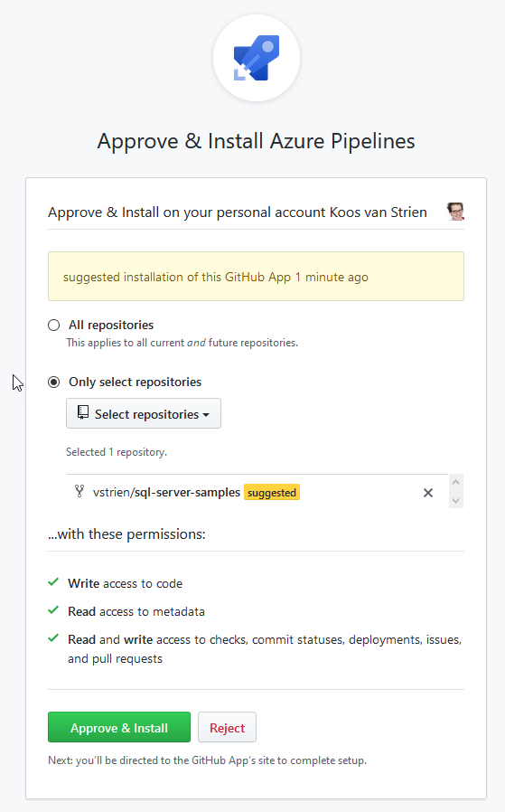
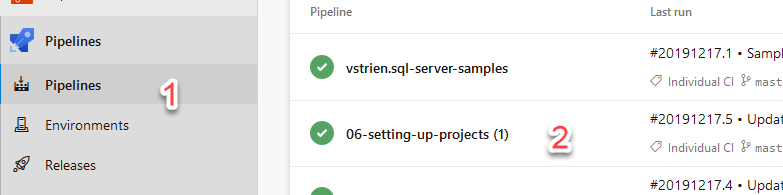
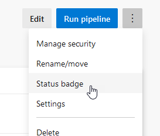
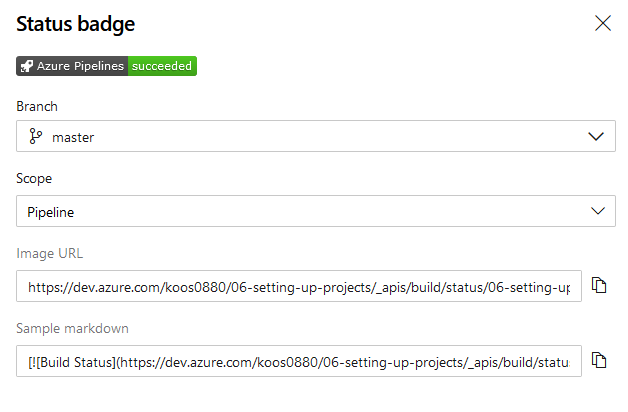

# Build Pipeline - Advanced Options

The basic pipeline "framework" was covered in the ["Setting up a basic build pipeline"](02-new-build-pipeline-basic.md) exercise. The complete pipeline, **including variables**, is shown below:

```yaml
# Build Pipeline for SQL Database

# The *trigger* specifies what triggers this pipeline to run automatically. In this case: a *commit* against *main*
trigger:
- main

# The *pool* specifies which VM image to use for executing this pipeline.
pool:
  name: Azure Pipelines
  vmImage: windows-latest

variables:
  BuildConfiguration: 'Release'

# Here come the actual "build steps". In this case, we have a "simple" build pipeline - we will look at pipelines with multiple "stages" later.
steps:
### You do not need to remember the configuration of a "task": Azure DevOps Pipelines has built-in visual tools for adding tasks and configuring their settings.
- task: VSBuild@1
  displayName: 'Build Data Warehouse'
  inputs:
    solution: 'src/AdventureWorksDW/AdventureWorksDW.sqlproj'
    configuration: '$(BuildConfiguration)'

- task: CopyFiles@2
  displayName: 'Copy Files to: $(Build.ArtifactStagingDirectory)'
  inputs:
    SourceFolder: '$(Build.SourcesDirectory)'
    Contents: '**/bin/$(BuildConfiguration)/**/*.dacpac'
    TargetFolder: '$(Build.ArtifactStagingDirectory)'

# The Artifact is the result of this pipeline. By publishing it, a deployment pipeline can pick it up for deployment to other environments.
- task: PublishPipelineArtifact@1
  inputs:
    targetPath: '$(Build.ArtifactStagingDirectory)'
    artifact: 'SQLDW'
    publishLocation: 'pipeline'
```

There are a few more options in Build pipelines worth exploring:

## Other Repositories (OPTIONAL)

Azure Pipelines can also use repositories other than its own Git/TFVC.

1. If you don't have a GitHub account yet, create one at [github.com](https://www.github.com).
2. Navigate to the Wide World Importers repository on GitHub ([https://github.com/Microsoft/sql-server-samples/tree/master/samples/databases/wide-world-importers](https://github.com/Microsoft/sql-server-samples/tree/master/samples/databases/wide-world-importers)).
3. **Fork** this repository. This means creating a copy of the repository in your own GitHub account.


With the *fork* action, we have copied the source code of the Wide World Importers database to our own Git repository on GitHub. Although this repository is not within Azure DevOps, we can still use it to set up a build.

4. Create a new pipeline and choose **GitHub** as the repository.
4. Select the **sql-server-samples** repository.
4. Grant the Azure Pipelines GitHub app access to the *sql-server-samples* repository.



You will now return to the Azure DevOps environment.

7. Under **Configure**, choose a **Starter pipeline**.
7. Use the YAML definition from the beginning of this module.
7. Modify the *Build Data Warehouse* step.
   * Parameter *Solution*: `samples/databases/wide-world-importers/wwi-dw-ssdt/WideWorldImportersDW/WideWorldImportersDW.sqlproj`
7. Save & Run (build takes about 1:30 min).

## Status Badge

To include the most recent build status, for example, in a Wiki or on another page

, you can include a **status badge**.

You can access it as follows:

1. Open **Pipelines**.
2. Open the pipeline you want to edit.
3. Click on the ellipsis (`...`) in the upper-right corner.
4. Choose **Status badge**.




You can now use the URL or the sample Markdown:



Try it out:

1. Place a status badge in the project Wiki.
2. Make the build fail (for example, through an incorrect check-in or deliberately modifying the build pipeline definition with errors).
3. Check if the *status badge* actually changes.

## Wildcards and Flatten Folders

The *Copy Files* task uses the following wildcard:

`**\bin\$(BuildConfiguration)\**\*.dacpac`

* The `**` means: any subfolder (no limitation on the number of levels deep).
* This means that the following options could all match (assuming `$(BuildConfiguration)` has the value `Release`):
  * `bin\Release\ABCD.dacpac`
  * `SQLServer\lots\of\subfolders\bin\Release\ABCD.dacpac`
  * `lots\of\subfolders\bin\Release\more\subfolders\ABCD.dacpac`

When you copy them to the artifacts directory, you have the option to preserve these subfolders or flatten them. You can do this using the "Flatten Folders" option.

* Can you think of situations where you would (or wouldn't) want to flatten the folder structure for the artifacts?